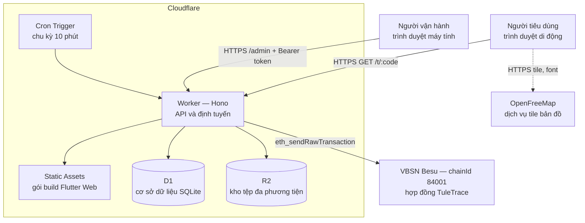
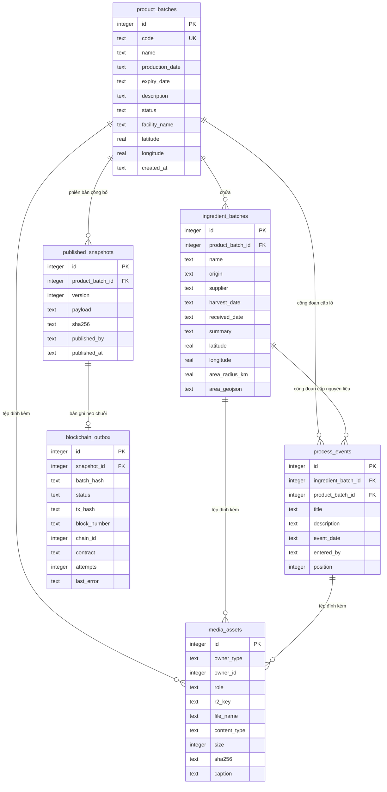
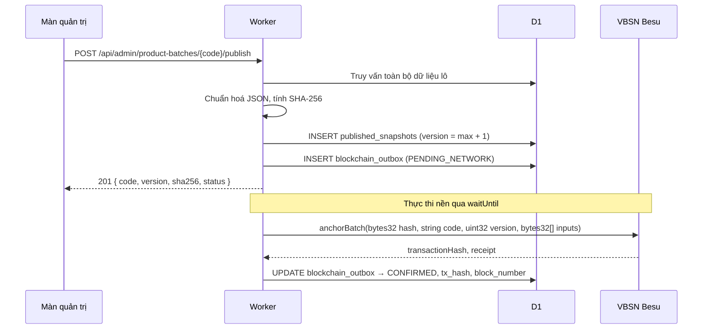
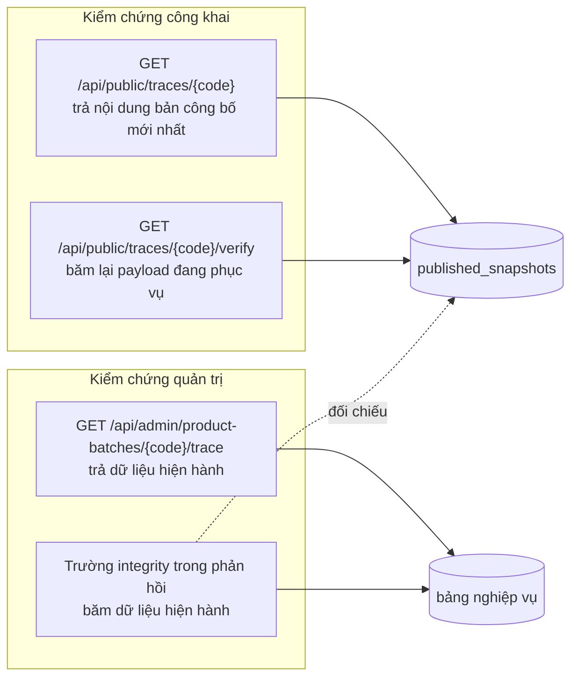

# Tài liệu kiến trúc hệ thống — Tú Lệ Trace

| | |
| --- | --- |
| Sản phẩm | Hệ thống truy xuất nguồn gốc Tú Lệ Smart Breakfast |
| Phiên bản tài liệu | 1.0 |
| Ngày ban hành | 09/09/2026 |
| Địa chỉ vận hành | https://tule-trace.sontm.workers.dev |
| Kho mã nguồn | https://github.com/sontm-jackson/com-tule |
| Tài liệu liên quan | [HUONG_DAN_SU_DUNG.md](HUONG_DAN_SU_DUNG.md), [../QUY_TRINH.md](../QUY_TRINH.md), [../BLOCKCHAIN.md](../BLOCKCHAIN.md), [../DEPLOY.md](../DEPLOY.md) |

## 1. Phạm vi

Tài liệu mô tả kiến trúc, mô hình dữ liệu, giao diện lập trình và các ràng buộc
kỹ thuật của hệ thống truy xuất nguồn gốc cho sản phẩm Tú Lệ Smart Breakfast.

Hệ thống cung cấp hai nhóm chức năng:

1. **Tra cứu công khai** — người tiêu dùng quét mã QR trên bao bì để xem hồ sơ
   lô sản phẩm: thành phần, vùng nguyên liệu, công đoạn sản xuất, hình ảnh và
   kết quả kiểm chứng tính toàn vẹn dữ liệu.
2. **Quản trị nội bộ** — người vận hành khai báo lô sản phẩm, nguyên liệu, công
   đoạn, tải tài liệu và hình ảnh, công bố phiên bản hồ sơ và neo mã băm lên
   blockchain.

## 2. Thuật ngữ

| Thuật ngữ | Định nghĩa |
| --- | --- |
| Lô sản phẩm | Một mẻ thành phẩm, định danh bằng mã truy xuất duy nhất (ví dụ `TL-2026-002`) |
| Lô nguyên liệu | Một loại nguyên liệu đầu vào của lô sản phẩm, kèm vùng trồng và nhà cung cấp |
| Công đoạn | Một bước trong quy trình, thuộc một lô nguyên liệu hoặc thuộc lô sản phẩm |
| Bản công bố (snapshot) | Bản ghi bất biến chứa toàn bộ nội dung lô tại thời điểm công bố, kèm mã băm SHA-256 |
| Neo chuỗi (anchor) | Giao dịch ghi mã băm của bản công bố lên blockchain |
| Mã băm | Giá trị SHA-256 tính trên biểu diễn JSON chuẩn hoá của bản công bố |

## 3. Kiến trúc tổng thể

Hệ thống triển khai trên nền tảng Cloudflare theo mô hình một Worker phục vụ
đồng thời giao diện web và API. Giao diện và API dùng chung một origin.



### 3.1 Thành phần và trách nhiệm

| Thành phần | Công nghệ | Trách nhiệm |
| --- | --- | --- |
| Giao diện web | Flutter Web 3.44 (CanvasKit), go_router | Trang tra cứu công khai và màn quản trị |
| Lớp API | Cloudflare Workers, Hono 4 | Định tuyến, xác thực, kiểm tra đầu vào, điều phối nghiệp vụ |
| Cơ sở dữ liệu | Cloudflare D1 (SQLite) | Lô, nguyên liệu, công đoạn, media, bản công bố, hàng chờ neo chuỗi |
| Kho tệp | Cloudflare R2 | Ảnh, video, hồ sơ kiểm nghiệm; khoá đặt theo nội dung |
| Bản đồ | MapLibre GL JS 6.4.1 (tự host), OpenFreeMap style Liberty | Hiển thị vùng nguyên liệu và tuyến vận chuyển |
| Tích hợp chuỗi | viem 2.x | Ký và gửi giao dịch neo mã băm |
| Blockchain | VBSN Besu, EVM, chainId 84001 | Lưu bằng chứng thời điểm và mã băm |

### 3.2 Tham số triển khai

| Tham số | Giá trị |
| --- | --- |
| RPC | `https://besu-rpc.vbsn.vn` |
| Explorer | `https://besu-explorer.vbsn.vn` |
| Địa chỉ hợp đồng | `0xcd6811f9a06d706978033edb6ecaf72d37ffd3ca` |
| Biến môi trường | `CHAIN_RPC_URL`, `CHAIN_ID`, `CHAIN_EXPLORER`, `TRACE_CONTRACT`, `CHAIN_AUTO_ANCHOR`, `MAX_UPLOAD_BYTES` |
| Secret | `ADMIN_TOKEN`, `PRIVATE_KEY` |
| Cron | `*/10 * * * *` |
| Giới hạn tệp tải lên | 31.457.280 byte (30 MB) |

## 4. Mô hình dữ liệu



### 4.1 Ràng buộc

| Bảng | Ràng buộc | Nội dung |
| --- | --- | --- |
| `product_batches` | UNIQUE | `code` là duy nhất toàn hệ thống |
| `process_events` | CHECK | Đúng một trong hai khoá ngoại `ingredient_batch_id` / `product_batch_id` khác NULL |
| `process_events` | Thứ tự | `position` quyết định thứ tự hiển thị; không suy ra từ `event_date` |
| `published_snapshots` | UNIQUE | `(product_batch_id, version)` |
| `media_assets` | Khoá nội dung | `r2_key` có dạng `media/<sha256>.<ext>` |
| Tất cả bảng con | ON DELETE CASCADE | Xoá lô kéo theo nguyên liệu, công đoạn, bản công bố |

### 4.2 Trạng thái

| Đối tượng | Trường | Giá trị |
| --- | --- | --- |
| Lô sản phẩm | `status` | `DRAFT`, `PUBLISHED` |
| Bản ghi neo chuỗi | `status` | `PENDING_NETWORK`, `CONFIRMED`, `FAILED`, `SKIPPED` |
| Kiểm chứng | (tính toán) | `VERIFIED`, `MISMATCH`, `NOT_PUBLISHED`, `UNKNOWN` |

## 5. Cơ chế toàn vẹn dữ liệu

### 5.1 Biểu diễn chuẩn hoá và mã băm

Bản công bố là một đối tượng JSON được chuẩn hoá trước khi băm:

1. Khoá sắp xếp theo thứ tự từ điển ở mọi cấp.
2. Không chứa định danh nội bộ (`id`), dấu thời gian hệ thống (`created_at`) và
   các trường phụ thuộc hạ tầng.
3. Trường không có dữ liệu bị loại khỏi payload, không ghi giá trị rỗng.
4. Tệp đính kèm tham chiếu bằng khoá nội dung `media/<sha256>.<ext>`, do đó thay
   đổi tệp làm thay đổi mã băm.
5. Hàm băm: SHA-256, kết quả biểu diễn hexa chữ thường, 64 ký tự.

Quy tắc (3) là điều kiện tương thích ngược: bổ sung trường mới vào payload không
làm thay đổi mã băm của các lô chưa sử dụng trường đó.

### 5.2 Luồng công bố và neo chuỗi



Cron chu kỳ 10 phút quét lại các bản ghi `PENDING_NETWORK` và `FAILED`
(`attempts < 5`) để xử lý trường hợp giao dịch không gửi được tại thời điểm công
bố. Biến `CHAIN_AUTO_ANCHOR` cho phép tắt neo tự động ở môi trường thử nghiệm;
điểm cuối `POST /api/admin/chain/send` luôn thực thi bất kể giá trị biến này.

### 5.3 Hợp đồng thông minh

Hợp đồng `TuleTrace` chỉ phát sự kiện, không lưu nội dung hồ sơ:

| Thành phần | Chữ ký |
| --- | --- |
| Sự kiện | `BatchAnchored(bytes32 indexed hash, address indexed by, string code, uint32 version, bytes32[] inputs, uint64 anchoredAt)` |
| Sự kiện | `IngredientAnchored(bytes32 indexed hash, address indexed by, string ref, uint64 anchoredAt)` |
| Sự kiện | `ActorSet(address indexed actor, uint8 role, string name)` |
| Hàm | `anchorBatch(bytes32, string, uint32, bytes32[])` — yêu cầu vai trò `BRAND` |
| Hàm | `anchorIngredient(bytes32, string)` — yêu cầu vai trò khác `NONE` |
| Hàm | `setActor(address, uint8, string)` — chỉ chủ sở hữu |

Chi phí một lần neo: 29.273 gas, tương đương 0,0000000293 VNX tại giá gas
1.000.007 wei.

Mã nguồn hợp đồng: `contracts/TuleTrace.sol`. ABI đã biên dịch:
`contracts/out/TuleTrace.json`.

### 5.4 Ngữ nghĩa kiểm chứng

Hệ thống phân biệt hai phép kiểm chứng có mục đích khác nhau:



| Phép kiểm chứng | Đối tượng so sánh | Ý nghĩa kết quả `MISMATCH` |
| --- | --- | --- |
| Công khai | Payload đang phục vụ ↔ mã băm đã lưu và đã neo | Dữ liệu công bố bị can thiệp ở tầng lưu trữ |
| Quản trị | Dữ liệu hiện hành ↔ bản công bố gần nhất | Có thay đổi chưa công bố |

Trang tra cứu công khai phục vụ nội dung của bản công bố, không phải dữ liệu
hiện hành. Thay đổi trong màn quản trị chỉ xuất hiện với người tiêu dùng sau khi
công bố phiên bản mới.

## 6. Quản lý tệp đa phương tiện

| Hạng mục | Quy định |
| --- | --- |
| Khoá lưu trữ | `media/<sha256>.<ext>`, suy ra từ nội dung tệp |
| Định dạng ảnh | JPEG, PNG, WebP, AVIF, GIF |
| Định dạng video | MP4, WebM, QuickTime |
| Hồ sơ | PDF, JPEG, PNG |
| Dung lượng tối đa | 30 MB mỗi tệp |
| Vai trò (`role`) | `cover`, `lab_report`, `gallery` |
| Phục vụ | `GET /api/media/media/<sha256>.<ext>`, hỗ trợ HTTP Range |
| Quy tắc lưu giữ | Không xoá object khỏi R2 nếu còn bản công bố tham chiếu tới khoá đó |

Do khoá đặt theo nội dung, tải lên cùng một tệp nhiều lần chỉ chiếm một object.

## 7. Giao diện lập trình

### 7.1 Điểm cuối công khai

| Phương thức | Đường dẫn | Mô tả |
| --- | --- | --- |
| GET | `/api/health` | Trạng thái dịch vụ và cấu hình hạ tầng |
| GET | `/api/public/featured` | Lô công bố gần nhất |
| GET | `/api/public/traces/{code}` | Hồ sơ lô theo bản công bố mới nhất |
| GET | `/api/public/traces/{code}/verify` | Kết quả kiểm chứng công khai |
| GET | `/api/media/media/{sha256}.{ext}` | Tệp đính kèm |

### 7.2 Điểm cuối quản trị

Yêu cầu tiêu đề `Authorization: Bearer <ADMIN_TOKEN>`.

| Phương thức | Đường dẫn | Mô tả |
| --- | --- | --- |
| GET | `/api/admin/session` | Kiểm tra token |
| GET | `/api/admin/summary` | Số liệu tổng hợp |
| GET | `/api/admin/product-batches` | Danh sách lô; tham số `q`, `sort`, `page`, `limit` |
| POST | `/api/admin/product-batches` | Tạo lô |
| PATCH | `/api/admin/product-batches/{code}` | Cập nhật thông tin lô |
| GET | `/api/admin/product-batches/{code}/trace` | Hồ sơ theo dữ liệu hiện hành |
| POST | `/api/admin/product-batches/{code}/publish` | Công bố phiên bản mới |
| GET | `/api/admin/product-batches/{code}/snapshots` | Danh sách bản công bố kèm trạng thái neo chuỗi |
| GET | `/api/admin/product-batches/{code}/snapshots/{version}` | Nội dung một bản công bố |
| POST | `/api/admin/ingredient-batches` | Tạo lô nguyên liệu |
| PATCH | `/api/admin/ingredient-batches/{id}` | Cập nhật lô nguyên liệu |
| DELETE | `/api/admin/ingredient-batches/{id}` | Xoá lô nguyên liệu và dữ liệu phụ thuộc |
| POST | `/api/admin/process-events` | Tạo công đoạn |
| PATCH | `/api/admin/process-events/{id}` | Cập nhật công đoạn |
| DELETE | `/api/admin/process-events/{id}` | Xoá công đoạn |
| GET | `/api/admin/media/config` | Giới hạn dung lượng và định dạng cho phép |
| POST | `/api/admin/media` | Tải tệp (multipart: `file`, `ownerType`, `ownerId`, `role`, `caption`) |
| DELETE | `/api/admin/media/{id}` | Gỡ tệp khỏi đối tượng |
| GET | `/api/admin/chain` | Trạng thái ví, mạng và hàng chờ |
| POST | `/api/admin/chain/send` | Gửi ngay các bản ghi trong hàng chờ |
| POST | `/api/admin/chain/retry` | Đặt lại bản ghi `FAILED` |

### 7.3 Mã trạng thái và lỗi

| Mã | Trường hợp |
| --- | --- |
| 200 / 201 | Thành công |
| 400 | Dữ liệu đầu vào không hợp lệ (thiếu trường, sai định dạng, vi phạm ràng buộc) |
| 401 | Thiếu hoặc sai token quản trị |
| 404 | Không tìm thấy đối tượng |
| 413 | Tệp vượt giới hạn dung lượng |
| 415 | Định dạng tệp không được phép |
| 503 | Chưa cấu hình `ADMIN_TOKEN` |

Thân phản hồi lỗi: `{ "error": "<MÃ_LỖI>", "message": "<mô tả tiếng Việt>" }`.

## 8. Cấu trúc mã nguồn

```text
lib/
  app/          Cấu hình kiểu URL theo nền tảng
  data/         TraceApi, phiên quản trị, quét QR, tải tệp, dữ liệu địa lý
  models/       TraceRecord, Ingredient, ProcessEvent, MediaAsset, IntegrityRecord
  pages/        ExplorerPage, ManagementPage
  ui/           Theme, khung trang, panel hành trình, bản đồ, media, thành phần dùng chung
worker/
  src/          index.ts, trace.ts, chain.ts, media.ts, canonical.ts, validate.ts, geojson.ts, env.ts
  migrations/   0001–0007
  scripts/      smoke-test, deploy-contract, chain-status, chain-verify, copy-batch, apply-process
  schema.sql    Định nghĩa bảng
  seed.sql      Dữ liệu khởi tạo
contracts/      TuleTrace.sol, ABI biên dịch
tools/          Sinh phông chữ, sinh ảnh nguyên liệu, sinh bộ nguyên liệu mẫu
assets/         Phông chữ, ảnh nguyên liệu, ảnh sản phẩm
```

## 9. Ràng buộc thiết kế

| Mã | Ràng buộc |
| --- | --- |
| RB-01 | Khi API không phản hồi, giao diện hiển thị trạng thái lỗi. Hệ thống không thay thế bằng dữ liệu mẫu. Dữ liệu mẫu chỉ hiển thị qua tham số `?demo=1` và luôn kèm cảnh báo |
| RB-02 | Nhãn giao diện phản ánh đúng trạng thái kỹ thuật. Trạng thái "đã lưu lên blockchain" chỉ hiển thị khi tồn tại giao dịch đã xác nhận |
| RB-03 | Trường không có dữ liệu không được đưa vào payload công bố |
| RB-04 | Không xoá object R2 khi còn bản công bố tham chiếu tới khoá đó |
| RB-05 | Không hiển thị vùng nguyên liệu ở độ chính xác cao hơn thứ dữ liệu thật sự có. Trường bán kính tự khai đã bị bỏ; vùng chỉ thể hiện bằng ảnh bản đồ hành chính do người vận hành tải lên, hoặc bằng ranh giới thật lưu ở `area_geojson` |
| RB-06 | Dữ liệu chi phí, giá vốn và lợi nhuận không được đưa vào payload công bố |
| RB-07 | Công bố không ghi đè bản trước; mỗi lần công bố tạo một phiên bản mới |

## 10. Yêu cầu phi chức năng

### 10.1 Hiệu năng

Đo trên trình duyệt di động, không dùng bộ nhớ đệm, trang `/t/{code}`:

| Hạng mục | Dung lượng truyền |
| --- | --- |
| CanvasKit (WebAssembly) | 2.150 KB |
| Mã ứng dụng | 1.081 KB |
| Thư viện bản đồ | 280 KB |
| Phông chữ ứng dụng | 208 KB |
| Tile và phông bản đồ | ~350 KB |
| Ảnh giao diện | 35 KB |
| **Tổng** | **≈ 4,4 MB** |

Lần truy cập sau sử dụng bộ nhớ đệm trình duyệt. Thời gian tới trạng thái
`networkidle` trên kết nối băng rộng: khoảng 4 giây.

### 10.2 Dung lượng và hạn mức

| Tài nguyên | Hạn mức gói hiện dùng |
| --- | --- |
| Workers | 100.000 request/ngày (gói miễn phí), không giới hạn ở gói trả phí |
| D1 | 5 GB dữ liệu |
| R2 | 10 GB lưu trữ, miễn phí băng thông ra |
| Giao dịch neo chuỗi | 0,0000000293 VNX/giao dịch |

### 10.3 Tương thích

Trình duyệt hỗ trợ WebAssembly và WebGL 2: Chrome, Edge, Firefox, Safari phiên
bản từ 2022 trở về sau. Chức năng quét QR bằng camera yêu cầu HTTPS và quyền
truy cập camera; khi không khả dụng, giao diện chuyển sang nhập mã thủ công.

## 11. An toàn thông tin

| Hạng mục | Biện pháp |
| --- | --- |
| Xác thực quản trị | Bearer token, so sánh theo thời gian hằng số, lưu trong secret của Worker |
| Khoá ký giao dịch | Secret `PRIVATE_KEY`, không xuất hiện trong mã nguồn hay kho mã |
| Tệp bí mật | `.env`, `worker/.dev.vars`, `worker/.admin-token.txt` được loại khỏi kho mã |
| Phân tách môi trường | Token và cơ sở dữ liệu của môi trường thử nghiệm tách khỏi môi trường vận hành |
| Dữ liệu cá nhân | Không ghi dữ liệu cá nhân lên blockchain |
| Truyền tải | HTTPS bắt buộc, chứng chỉ do Cloudflare cấp |

**Giới hạn hiện tại**: hệ thống dùng một token quản trị dùng chung, chưa có tài
khoản riêng cho từng người vận hành và chưa có nhật ký thao tác ở mức từng lần
sửa. Chưa áp dụng giới hạn tần suất trên các điểm cuối công khai.

## 12. Kiểm thử

| Hạng mục | Lệnh | Phạm vi |
| --- | --- | --- |
| Phân tích tĩnh | `flutter analyze` | Toàn bộ mã Dart |
| Kiểm thử giao diện | `flutter test` | 39 trường hợp: bộ phân tích dữ liệu, bố cục ở 360/768/1440 px, bản đồ, luồng quản trị, ranh giới hiển thị trạng thái chuỗi |
| Kiểm kiểu backend | `npx tsc --noEmit` | Toàn bộ mã TypeScript |
| Kiểm thử tích hợp | `node scripts/smoke-test.js` | Xác thực, mã lỗi, tải tệp, HTTP Range, media trong snapshot, công bố, hàng chờ neo chuỗi, SPA fallback |
| Kiểm chứng độc lập | `node scripts/chain-verify.mjs <contract> <sha256>` | Đọc sự kiện trực tiếp từ blockchain |

## 13. Tuân thủ tiêu chuẩn

Phần đối chiếu chi tiết với Thông tư 02/2024/TT-BKHCN, TCVN 13274:2020, TCVN
13275:2020, GS1 EPCIS và ISO 22005 được trình bày trong
[../QUY_TRINH.md](../QUY_TRINH.md), bao gồm danh sách hạng mục đã đáp ứng và
hạng mục còn thiếu (mã GTIN/GLN, GS1 Digital Link, dữ liệu khối lượng và định
mức).

## 14. Lộ trình kỹ thuật

| Hạng mục | Nội dung | Tài liệu |
| --- | --- | --- |
| Khối lượng và định mức | Bổ sung khối lượng đầu vào, đầu ra, quy cách đóng gói; kiểm tra cân bằng khối lượng | [../QUY_TRINH.md](../QUY_TRINH.md) mục 4a |
| Tham số công đoạn | Trường dữ liệu có cấu trúc cho nhiệt độ, thời gian, tỷ lệ | [../QUY_TRINH.md](../QUY_TRINH.md) mục 4b |
| Mã theo chuẩn GS1 | GTIN, GLN, GS1 Digital Link trong nội dung mã QR | [../QUY_TRINH.md](../QUY_TRINH.md) mục 5 |
| Chữ ký của nhà cung cấp | Mỗi nhà cung cấp tự ký lô nguyên liệu; khoá lưu trên thiết bị, hệ thống trả phí giao dịch | [../BLOCKCHAIN.md](../BLOCKCHAIN.md) |
| Tài khoản người dùng | Tài khoản riêng cho từng người vận hành, nhật ký thao tác | [../BLOCKCHAIN.md](../BLOCKCHAIN.md) mục 4 |

Ba hạng mục đầu và hai hạng mục cuối khác nhau về bản chất phụ thuộc: hạng mục
mã GS1 bị chặn bởi một thủ tục hành chính, không phải bởi khối lượng công việc
lập trình.

### 14.1. Điều kiện áp dụng mã GS1

GTIN (mã sản phẩm) và GLN (mã địa điểm) được sinh ra từ mã doanh nghiệp GS1 do
GS1 Việt Nam cấp cho từng doanh nghiệp. Hệ thống không thể tự sinh các mã này:
một dãy số tự đặt sẽ nằm trong dải mã đã cấp cho doanh nghiệp khác.

**Phần thuộc hệ thống** (ước tính nửa ngày công khi đã có mã):

| Hạng mục | Nội dung |
| --- | --- |
| Lược đồ | Thêm cột `gtin` cho `product_batches` và `gln` cho nơi sản xuất |
| Vật mang dữ liệu | Nội dung mã QR chuyển sang GS1 Digital Link: `https://<tên miền>/01/{GTIN}/10/{số lô}` |
| Định tuyến | Thêm route đọc dạng Digital Link, giữ song song `/t/{mã lô}` để tem đã in vẫn phân giải được |
| Payload công bố | Bổ sung `gtin`, `gln` vào bản công bố; theo quy tắc mục 5.1, lô chưa có mã vẫn giữ nguyên mã băm cũ |

**Phần thuộc doanh nghiệp** (thủ tục với GS1 Việt Nam):

| Hạng mục | Nội dung |
| --- | --- |
| Hồ sơ | Giấy chứng nhận đăng ký kinh doanh, bản đăng ký sử dụng mã số mã vạch, bảng đăng ký danh mục sản phẩm sử dụng mã GTIN |
| Phí cấp mã doanh nghiệp GS1 | 1.000.000 đồng |
| Phí cấp mã địa điểm GLN | 300.000 đồng |
| Phí duy trì | Theo năm, mức thu phụ thuộc loại mã doanh nghiệp (7, 8, 9 hoặc 10 số) |
| Nơi nộp | Trực tuyến qua cổng VNPC; hồ sơ giấy nộp tại Trung tâm Mã số Mã vạch Quốc gia |

Căn cứ mức phí: Thông tư 232/2016/TT-BTC. Cần kiểm tra lại biểu phí hiện hành
tại thời điểm nộp hồ sơ.

**Ràng buộc về thời điểm**: nội dung mã QR cố định trong bản in bao bì. Việc
chuyển sang GS1 Digital Link cần được quyết định trước khi in hàng loạt; tem in
theo định dạng `/t/{mã lô}` vẫn phân giải được sau khi chuyển đổi, nhưng không
đáp ứng TCVN 13275:2020 về định dạng vật mang dữ liệu.
